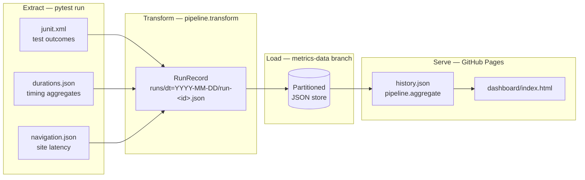

# site-sentry

[](https://github.com/dardenkyle/site-sentry/actions/workflows/tests.yml)
[](https://github.com/dardenkyle/site-sentry/commits/main)

Automated QA suite for [kyledarden.com](https://kyledarden.com) built with Playwright + Pytest. Runs smoke, navigation, and UI tests in CI to keep the site fast and reliable. Features twice-daily automated checks, HTML reports, and easy local/Docker execution.

## Features

- **Playwright-powered**: Modern, reliable browser automation
- **Comprehensive tests**: Smoke tests, UI validation, and navigation checks
- **Containerized**: Full Docker support for consistent environments
- **CI/CD ready**: Automated runs twice daily with GitHub Actions
- **Rich reporting**: HTML test reports auto-generate with screenshots on failure
- **Trend dashboard**: per-run metrics persisted to a durable store and served as a
  GitHub Pages uptime/performance dashboard (see [Metrics Pipeline](#metrics-pipeline--trend-dashboard))
- **Fast & efficient**: Optimized for quick feedback (~2m 30s in CI)
- **uv-managed**: Fast, modern Python dependency management with a committed lockfile
- **Fully typed**: Type hints throughout for better IDE support

## Quick Start

### Prerequisites

- Python 3.12.13 (pinned in `.python-version`; uv provisions it automatically)
- [uv](https://docs.astral.sh/uv/) (for dependency management)

### Local Installation

1. **Clone the repository**

   ```bash
   git clone https://github.com/dardenkyle/site-sentry.git
   cd site-sentry
   ```

2. **Install uv** (if not already installed)

   ```bash
   # Windows (PowerShell)
   powershell -ExecutionPolicy ByPass -c "irm https://astral.sh/uv/install.ps1 | iex"

   # macOS/Linux
   curl -LsSf https://astral.sh/uv/install.sh | sh
   ```

3. **Install dependencies**

   ```bash
   uv sync
   uv run playwright install chromium
   ```

4. **Configure environment** (optional)

   ```bash
   cp .env.example .env
   # Edit .env if needed to customize settings
   ```

5. **Run tests**
   ```bash
   uv run pytest -v
   ```

### Docker Run

Run tests in a containerized environment:

```bash
# Build the image
docker build -t site-sentry .

# Run tests
docker run --rm site-sentry

# Run with custom environment
docker run --rm -e BASE_URL=https://kyledarden.com site-sentry

# Extract test results
docker run --rm -v $(pwd)/test-results:/app/test-results site-sentry
```

## Test Structure

```
tests/
├── conftest.py               # Pytest configuration and fixtures
├── smoke/
│   ├── test_config.py        # Configuration and environment checks
│   └── test_smoke.py         # Critical smoke tests
├── ui/
│   ├── test_contact_form.py  # Contact form tests
│   └── test_ui_nav.py        # UI and navigation tests
└── utils/
    └── logger.py             # Logging utilities
```

### Test Categories

- **Smoke tests** (`@pytest.mark.smoke`): Fast, critical tests verifying core functionality
- **UI tests** (`@pytest.mark.ui`): User interface and navigation validation
- **Slow tests** (`@pytest.mark.slow`): Longer-running comprehensive tests

### Running Specific Tests

```bash
# Run only smoke tests
uv run pytest -m smoke

# Run only UI tests
uv run pytest -m ui

# Run specific test file
uv run pytest tests/smoke/test_smoke.py

# Run with verbose output
uv run pytest -v

# Run against a specific engine (install it first:
# uv run playwright install firefox webkit); CI runs all three
uv run pytest --browser firefox

# HTML reports auto-generate at test-results/report.html
```

## Configuration

Configuration is managed via environment variables. Copy `.env.example` to `.env` and customize:

```bash
# Target website
BASE_URL=https://kyledarden.com

# Browser settings
HEADLESS=true
SLOWMO=0
BROWSER=chromium          # chromium, firefox, or webkit; --browser wins
VIEWPORT_WIDTH=1280
VIEWPORT_HEIGHT=720

# Output
TEST_RESULTS_DIR=test-results
SCREENSHOTS_DIR=test-results/screenshots
LOG_LEVEL=INFO
```

Navigation timeouts are deliberate constants in `tests/utils/timing.py`,
not an environment setting: an unchosen timeout value had previously
become the suite's de-facto performance gate, so the ceilings now live
in code where they read as a decision (see issues #57-61).

## CI/CD

Tests run automatically via GitHub Actions:

- **On push/PR** (`ci.yml`): Every commit to main and pull requests, across a
  browser matrix of Chromium, Firefox, and WebKit so a rendering bug in any one
  engine is caught. Also runs lint, type-check, and a Docker smoke test.
- **Scheduled** (`tests.yml`): Twice daily at 6 AM and 6 PM UTC, Chromium only.
  This is availability monitoring whose result drives the site-down incident
  issue, so it stays single-browser deliberately.
- **Manual**: Via workflow_dispatch

Test results and HTML reports are uploaded as artifacts (one per browser on
push/PR) and retained for 30 days.

## Metrics Pipeline & Trend Dashboard

Artifacts expire after 30 days, so no history survives them. To turn each
scheduled run into durable trend data, the `publish` job in `tests.yml` runs a
small end-to-end data pipeline over the run's results and serves the accumulated
history as a static [GitHub Pages](https://dardenkyle.github.io/site-sentry/)
dashboard - pass-rate over time, page-load latency trend, and a last-incident
summary.



- **Extract**: the pytest run writes three raw artifacts to `test-results/` -
  `junit.xml` (per-test outcomes), `durations.json` (per-test call durations and
  aggregates), and `navigation.json` (the site's own first-navigation latency
  from the Navigation Timing API).
- **Transform** (`pipeline/transform.py`): joins those into one canonical
  `RunRecord` keyed by run ID and writes it to a date-partitioned, run-keyed path.
- **Load**: the record is committed to an orphan **`metrics-data`** branch that
  serves as the durable store - git as a zero-infra warehouse. The run-keyed
  filename makes the load idempotent: re-running a workflow overwrites its own
  record instead of appending a duplicate.
- **Serve** (`pipeline/aggregate.py` + `dashboard/`): the whole store is folded
  into one `history.json`, published to GitHub Pages beside the self-contained
  dashboard, which charts the full history rather than the latest run.

### Run-record schema

Each record is one run, `schema_version`-stamped so old and new records stay
distinguishable as the shape evolves. Top-level fields:

| Field | Type | Meaning |
|-------|------|---------|
| `schema_version` | int | Contract version the record was written under |
| `run_id` | string | CI run ID; the store's dedupe key (`"local"` off CI) |
| `run_number` | int \| null | Human-facing CI run number |
| `timestamp` | string | ISO-8601 UTC instant the metrics were written |
| `trigger` | string | What started the run (`schedule`, `workflow_dispatch`, …) |
| `browser` | string \| null | Engine the run exercised |
| `commit_sha` | string \| null | Commit the run tested |
| `counts` | object | Pass/fail tally (below) |
| `duration` | object | Timing aggregates in seconds (below) |
| `navigation` | object | First-navigation latency in ms (below) |
| `cases` | array | Per-test `{nodeid, outcome, duration_s}` |

- **`counts`**: `total`, `passed`, `failed`, `errors`, `skipped`, and `pass_rate`
  (passed / non-skipped; `null` when nothing ran).
- **`duration`**: `max_s`, `median_s`, `p95_s`, `slow_count`, `retried_count`,
  and `wall_s` (junit wall time).
- **`navigation`**: `error` (or `null`), and `ttfb_ms`, `dom_content_loaded_ms`,
  `load_ms`, `connect_ms` (all `null` on a failed navigation).

### One-time setup

The dashboard deploys via GitHub Pages with **GitHub Actions** as the source
(repo Settings → Pages → Build and deployment → Source). Until that is enabled
the pipeline still runs and records still accrue on `metrics-data`; only the
Pages deploy step is skipped. The store branch bootstraps itself on the first
scheduled run, so no manual branch creation is needed.

### Running the pipeline locally

```bash
# After a run has produced test-results/ artifacts:
uv run python -m pipeline.transform --store-dir store   # write this run's record
uv run python -m pipeline.aggregate --store-dir store --out dashboard/history.json
# Then open dashboard/index.html (serve the folder so fetch() works):
python -m http.server -d dashboard 8000
```

## Development

### Code Quality

```bash
# Type checking
uv run mypy tests/

# Linting
uv run ruff check tests/

# Format checking
uv run ruff format --check tests/
```

### Adding New Tests

1. Create the test file in the matching category directory (`tests/smoke/`, `tests/ui/`); the filename must start with `test_`
2. Add appropriate markers (`@pytest.mark.smoke`, `@pytest.mark.ui`, etc.)
3. Use fixtures from `conftest.py` (page, context, base_url)
4. Add type hints and docstrings
5. Run tests locally before committing

## Project Structure

```
site-sentry/
├── .github/
│   └── workflows/
│       ├── ci.yml               # Push/PR: lint, type-check, docker, browser-matrix tests
│       └── tests.yml            # Scheduled QA monitoring + incident alerts + metrics publish
├── pipeline/                    # Metrics pipeline (transform + aggregate, stdlib only)
│   ├── schema.py                # Canonical RunRecord schema
│   ├── transform.py             # Raw artifacts -> one run record
│   └── aggregate.py             # Record store -> dashboard history.json
├── dashboard/
│   └── index.html               # Self-contained trend dashboard (GitHub Pages)
├── tests/
│   ├── __init__.py
│   ├── conftest.py              # Pytest configuration
│   ├── smoke/                   # Smoke tests
│   ├── ui/                      # UI/navigation tests
│   ├── pipeline/                # Offline unit tests for the metrics pipeline
│   └── utils/
│       ├── __init__.py
│       └── logger.py            # Logging utility
├── .dockerignore                # Docker build exclusions
├── .editorconfig                # Editor formatting rules
├── .env.example                 # Environment template
├── .gitignore                   # Git ignore rules
├── .python-version              # Pinned Python version (uv)
├── CONTRIBUTING.md              # Contribution guidelines
├── Dockerfile                   # Container definition
├── LICENSE                      # MIT License
├── pyproject.toml               # Project configuration
├── uv.lock                      # Locked dependency versions
└── README.md                    # This file
```

## Contributing & Standards

This project follows consistent formatting and contribution standards:

- Code style and indentation enforced via [`.editorconfig`](.editorconfig)
- Linting, formatting, and type checks handled by **Ruff** and **mypy**, enforced in CI
- Pre-commit hooks are planned (#9); until then, run the checks below before committing
- See [CONTRIBUTING.md](CONTRIBUTING.md) for branch naming, commit style, and PR guidelines

**Quick reference:**

```bash
uv run ruff check .
uv run ruff format .
uv run mypy .
uv run pytest -v
```

## License

MIT License - see [LICENSE](LICENSE) file for details.

## Author

Kyle Darden - [kyledarden.com](https://kyledarden.com)
